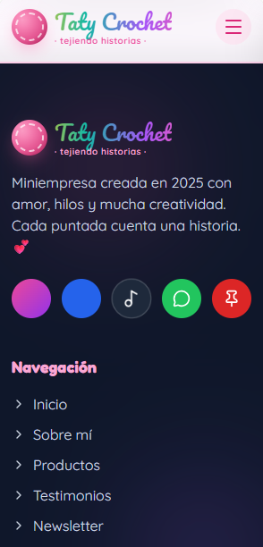

# 🧶 Taty Crochet - Sitio Web Oficial

Este repositorio contiene el código fuente de la plataforma web oficial de **Taty Crochet**, una microempresa dedicada a la confección de amigurumis, accesorios, decoración y regalos únicos tejidos 100% a mano. 

El proyecto tiene como objetivo digitalizar el negocio, potenciar su marca, exhibir un catálogo interactivo y conectar emocionalmente con la comunidad a través de historias tejidas "una a una".

---

## 🚀 Arquitectura y Tecnologías

El sitio está construido utilizando herramientas de última generación para garantizar un rendimiento óptimo, SEO impecable y carga instantánea:

*   **Astro 7.0 (SSG):** Utilizado como framework principal para compilar un sitio web estático ultra rápido sin Javascript innecesario.
*   **Tailwind CSS v4 (con Vite):** Implementado mediante `@tailwindcss/vite` para lograr un diseño responsivo, fluido y adaptado a móviles (*Mobile-first*) utilizando la última especificación de utilidades.
*   **TypeScript:** Configurado en modo estricto para asegurar un tipado limpio y un mantenimiento de código robusto a largo plazo.

---

## 📸 Capturas del Diseño

Para garantizar la mejor experiencia de usuario en cualquier dispositivo, la interfaz fue diseñada bajo una filosofía *mobile-first* antes de escalarla a pantallas grandes:

### 🖥️ Vista de Escritorio (Desktop)

*Interfaz limpia con una distribución espacial óptima para catálogos y storytelling.*

### 📱 Vista Móvil (Mobile Responsive)


*Diseño compacto, menús accesibles y botones de acción rápidos optimizados para navegación táctil.*

---

## 📂 Estructura del Proyecto

El proyecto sigue la arquitectura nativa de Astro estructurada de la siguiente manera:

```text
tatixx-crochet/
├── public/                 # Archivos estáticos públicos (Favicon, fuentes)
├── src/
│   ├── assets/             # Logotipos, iconos e imágenes optimizadas del diseño
│   ├── components/         # Componentes modulares reutilizables (Botones, Tarjetas, Headers)
│   ├── layouts/            # Estructura HTML base y plantillas de metadatos (SEO)
│   └── pages/              # Enrutamiento estático basado en archivos
│       └── index.astro     # Página de inicio oficial (Landing Page)
├── astro.config.mjs        # Configuración de Astro con el plugin de Tailwind CSS v4
├── package.json            # Gestión de scripts y dependencias (Astro ^7.0.3)
└── tsconfig.json           # Configuración del compilador TypeScript en modo estricto
```

---

## 🛠️ Comandos de Desarrollo

Asegúrate de tener instalado **Node.js (versión >= 22.12.0)** antes de ejecutar los comandos en tu terminal:

### 1. Preparar el Entorno
Instala todos los módulos y paquetes necesarios con:
```bash
npm install
```

### 2. Levantar Servidor Local
Para trabajar en el proyecto viendo los cambios en tiempo real (`localhost:4321`):
```bash
npm run dev
```
*(Nota opcional: Puedes iniciarlo en segundo plano usando `astro dev --background` si estás utilizando asistentes en el editor).*

### 3. Compilar para Producción
Genera el código minificado, optimizado y listo para ser desplegado en servidores como Vercel o Netlify:
```bash
npm run build
```

### 4. Vista Previa de Producción
Prueba localmente el sitio compilado exactamente como lo verían tus usuarios en internet:
```bash
npm run preview
```

---

## 🗺️ Hoja de Ruta (Roadmap del Proyecto)

- [ ] Reemplazar el componente por defecto `Welcome.astro` por la interfaz real de **Taty Crochet**.
- [ ] Implementar la sección interactiva de "Productos y Amigurumis".
- [ ] Agregar el bloque de testimonios para reflejar los +200 clientes felices.
- [ ] Optimizar etiquetas Meta y Open Graph para un excelente posicionamiento SEO orgánico.


## 🧞 Commands

All commands are run from the root of the project, from a terminal:

| Command                   | Action                                           |
| :------------------------ | :----------------------------------------------- |
| `npm install`             | Installs dependencies                            |
| `npm run dev`             | Starts local dev server at `localhost:4321`      |
| `npm run build`           | Build your production site to `./dist/`          |
| `npm run preview`         | Preview your build locally, before deploying     |
| `npm run astro ...`       | Run CLI commands like `astro add`, `astro check` |
| `npm run astro -- --help` | Get help using the Astro CLI                     |

## 👀 Want to learn more?

Feel free to check [our documentation](https://docs.astro.build) or jump into our [Discord server](https://astro.build/chat).
